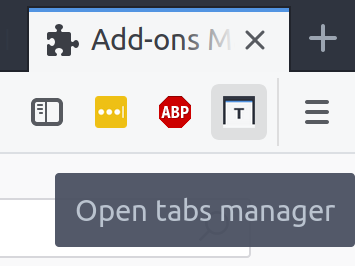
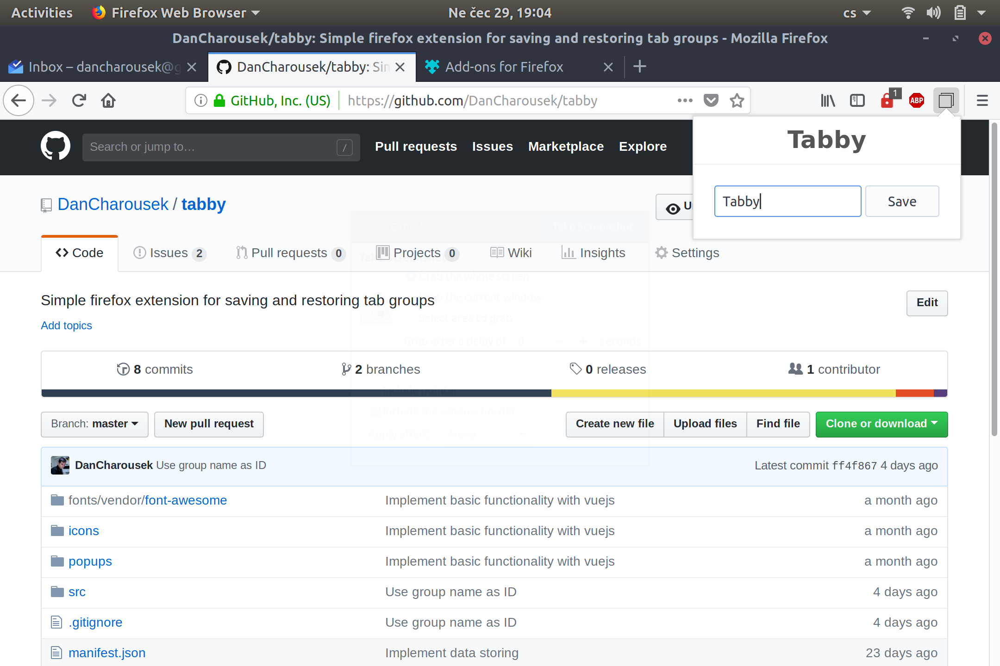

# Tabby

Tabby is a simple Firefox extension that allows you to easily switch between different set of tabs and helps you with managing clean working environment.

## What can it do for me?

* It comes in form of simple item in your Firefox's toolbar

Once you have set of tabs you find yourself coming back to often. You just need to name the group and hit the Save button.

Create as many groups as you want:

And you're done. Switching between different groups is just matter of clicking on it's name.

Don't forget that opening group closes all tabs in the current window, so don't get surprised.

## Is Tabby useful to me?
It depends. If you don't use Firefox, you will probably be ok without Tabby. But if you do, there is a chance it might be helpful to you.

## Give me an example.
Imagine you have three different use-cases when working with your browser.

1. Working environment - Whatever job you do, it might consist of your email client, if you're a developer you will probably have a VCS repository opened, issue tracker and lots of work-related tools.
2. Education - Despite all of your knowledge, you might want to educate yourself even more. This set of tabs might content scientific papers, educational videos, some tool for making notes, etc.
3. Personal - Sometime you will want to spare some time online doing not that much. For these occasions you might want to read news, watch online videos or play some games.

You don't like to have all those tabs mixed together, but it's really clumsy to switch between these tabs without closing them all and then opening again after you're done with your work.

This is where Tabby comes in play. Save opened window as a new group of tabs, name it and never have to worry about forgetting some tab again.

If you are that kind of person who starts his browser and immediately opens certain tabs as usual, tabby might be something you are looking for.

## TODO - Once tabby is available from mozilla addons put link here